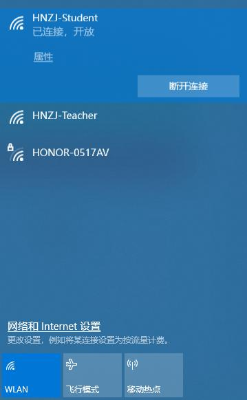
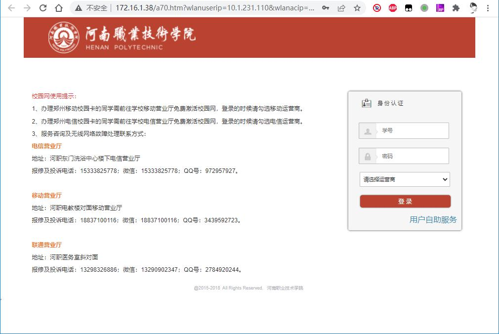
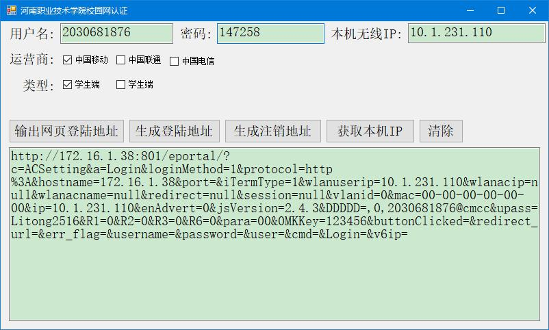

# hnzj-college-network-client
河南职业技术学院校园网登录客户端  
用于简化校园网登录的步骤
## 问题描述
### 正常情况下
使用笔记本计算机链接校园网之后,会会自动跳转到登录界面,输入用户名和密码,选择运营商,点击登录

### 存在的问题
- 链接wifi之后有时并不会跳转到登录界面,需要手动输入1.1.1.1进行跳转
- 跳转需要手动输入用户名和密码,并选择运营商,操作比较繁琐
- 输入用户名,密码,运营商之后才会向服务器发起登录请求

## 解决方案
- 开发一个程序,可以记住用户名和密码和运营商
- 根据用户名,密码,运营商,本机IP等信息,生成登录地址,将该登录地址粘贴到浏览器地址栏即可登录成功
## 使用方法
1.连接wifi
2.打开软件,软件会自动获取本机wifiIP,输入用户名和密码,选择运营商,软件显示如下(仅需在第一次使用时输入)
  
2.将最后一个文本框中的地址地址栏粘贴到浏览器中,即可登录成功
